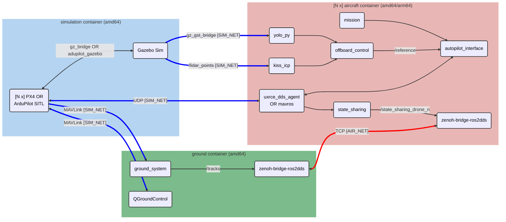

# aerial-autonomy-stack

*Aerial autonomy stack* (AAS) is an all-in-one software stack to:

1. **Develop** multi-drone autonomy—with ROS2, PX4, and ArduPilot
2. **Simulate** faster-than-real-time perception and control—with YOLOv8 and 3D LiDAR 
3. **Deploy** in real drones—with JetPack and NVIDIA Orin

<details>
<summary><b>Feature list</b> <i>(click to expand)</i></summary>

- **PX4 and ArduPilot multi-vehicle** simulation (**quadrotors and VTOLs**)
- ROS2 action-based autopilot interface (*via* XRCE-DDS or MAVROS)
- **YOLOv8** (with ONNX GPU Runtimes) and **LiDAR** Odometry (with [KISS-ICP](https://github.com/PRBonn/kiss-icp))
- 3D worlds for perception-based simulation
- **Steppable** [Gymnasium environment](https://gymnasium.farama.org/index.html) and **faster-than-real-time**, **multi-instance** simulation
- Gazebo's wind effects plugin
- **Dockerized simulation** based on [`nvcr.io/nvidia/cuda:12.8.1-cudnn-runtime-ubuntu22.04`](https://catalog.ngc.nvidia.com/orgs/nvidia/containers/cuda/tags)
- **Dockerized deployment** based on [`nvcr.io/nvidia/l4t-jetpack:r36.4.0`](https://catalog.ngc.nvidia.com/orgs/nvidia/containers/l4t-jetpack/tags)
- **Windows 11** compatibility *via* WSLg
- Multi-**Jetson-in-the-loop (HITL) simulation** to test NVIDIA- and ARM-based on-board compute
- Dual network to separate simulated sensors (`SIM_SUBNET`) and inter-vehicle comms (`AIR_SUBNET`)
- [Zenoh](https://github.com/eclipse-zenoh/zenoh-plugin-ros2dds) inter-vehicle ROS2 bridge
- [PX4 Offboard](https://docs.px4.io/main/en/flight_modes/offboard.html) interface (e.g. CTBR/`VehicleRatesSetpoint` for agile, GNSS-denied flight) 
- [ArduPilot Guided](https://ardupilot.org/copter/docs/ac2_guidedmode.html) interface (i.e. `setpoint_velocity`, `setpoint_accel` references)
- Logs analysis with [`flight_review`](https://github.com/PX4/flight_review) (`.ulg`), MAVExplorer (`.bin`), and [PlotJuggler](https://github.com/facontidavide/PlotJuggler) (`rosbag`)

</details>

https://github.com/user-attachments/assets/57e5bc91-8bee-4bae-8f81-a9aacef471e7

## Overview



<details>
<summary>Repo Structure <i>(click to expand)</i></summary>

```sh
aerial-autonomy-stack
│
├── aas-gym
│   └── src
│       └── aas_gym
│           └── aas_env.py                          # aerial-autonomy-stack as a Gymnasium environment
│
├── aircraft
│   ├── aircraft_ws
│   │   └── src
│   │       ├── autopilot_interface                 # Ardupilot/PX4 high-level actions (Takeoff, Orbit, Offboard, Land)
│   │       ├── mission                             # Orchestrator of the actions in `autopilot_interface` 
│   │       ├── offboard_control                    # Low-level references for the Offboard action in `autopilot_interface` 
│   │       ├── state_sharing                       # Publisher of the `/state_sharing_drone_N` topic broadcasted by Zenoh
│   │       └── yolo_py                             # GStreamer video acquisition and publisher of YOLO bounding boxes
│   │
│   └── aircraft.yml.erb                            # Aircraft docker tmux entrypoint
│
├── ground
│   ├── ground_ws
│   │   └── src
│   │       └── ground_system                       # Publisher of topic `/tracks` broadcasted by Zenoh
│   │
│   └── ground.yml.erb                              # Ground docker tmux entrypoint
│
├── scripts
│   ├── docker
│   │   ├── Dockerfile.aircraft                     # Docker image for aircraft simulation and deployment
│   │   ├── Dockerfile.ground                       # Docker image for ground system simulation and deployment
│   │   └── Dockerfile.simulation                   # Docker image for SITL and HITL simulation
│   │
│   ├── deploy_build.sh                             # Build `Dockerfile.aircraft` for arm64/Orin
│   ├── deploy_run.sh                               # Start the aircraft docker on arm64/Orin or the ground docker on amd64 (deploy or HITL)
│   │
│   ├── gym_run.py                                  # Examples for the Gymnasium aas-gym package
│   │
│   ├── sim_build.sh                                # Build all dockerfiles for amd64/simulation
│   └── sim_run.sh                                  # Start the simulation (SITL or HITL)
│
└── simulation
    ├── simulation_resources
    │   ├── aircraft_models
    │   │   ├── alti_transition_quad                # ArduPilot VTOL model
    │   │   ├── iris_with_ardupilot                 # ArduPilot quad model
    │   │   ├── sensor_camera                       # Camera model
    │   │   ├── sensor_lidar                        # LiDAR model
    │   │   ├── standard_vtol                       # PX4 VTOL model
    │   │   └── x500                                # PX4 quad model
    │   └── simulation_worlds
    │       ├── apple_orchard.sdf
    │       ├── impalpable_greyness.sdf
    │       ├── shibuya_crossing.sdf
    │       └── swiss_town.sdf
    │
    └── simulation.yml.erb                          # Simulation docker tmux entrypoint
```
</details>

## Installation

> AAS is tested on Ubuntu 22.04 with `nvidia-driver-580` using an i7-11 with 16GB RAM and RTX 3060
> 
> On Ubuntu, read [`REQUIREMENTS_UBUNTU.md`](/supplementary/REQUIREMENTS_UBUNTU.md) to setup the requirements (Docker Engine, `nvidia-ctk`)
>
> On Windows 11, read [`REQUIREMENTS_WSL.md`](/supplementary/REQUIREMENTS_WSL.md) to setup WSLg and the requirements

```sh
sudo apt update && sudo apt install -y git git-lfs xterm xfonts-base && git lfs install

git clone https://github.com/JacopoPan/aerial-autonomy-stack.git
cd aerial-autonomy-stack/scripts/

./sim_build.sh
# Note: the 1st build takes ~30GB of space and ~25' with good internet (`Ctrl + c` and restart if needed)
```

<div align="right">
  <a href="https://github.com/JacopoPan/aerial-autonomy-stack/actions/workflows/simulation-amd64-build.yml">
    
  </a>
  <a href="https://github.com/JacopoPan/aerial-autonomy-stack/actions/workflows/ground-amd64-build.yml">
    
  </a>
  <a href="https://github.com/JacopoPan/aerial-autonomy-stack/actions/workflows/aircraft-amd64-build.yml">
    
  </a>
</div>

---

## Simulation


> On a low-mid range laptop—i7-11 with 16GB RAM and RTX 3060—AAS can simulate a PX4 quad with YOLO and LiDAR at **10x real-time-factor** with flag `RTF=0.0`. Run multiple `sim_run.sh` in parallel adding flag `INSTANCE=1`, `INSTANCE=2`, etc. for even higher throughput. Make sure you run `sudo prime-select nvidia` and rebooted to leverage GPU rendering and compute.

```sh
# 1. Start AAS
cd aerial-autonomy-stack/scripts
AUTOPILOT=px4 NUM_QUADS=1 NUM_VTOLS=1 WORLD=swiss_town RTF=3.0 ./sim_run.sh                   # Start a simulation, check the script for more options (note: ArduPilot SITL checks take ~40s before being ready to arm)
```

In any of the `QUAD` or `VTOL` Xterm terminals:
```sh
# 2. Fly
ros2 run mission mission --ros-args -r __ns:=/Drone$DRONE_ID -p use_sim_time:=true            # This mission is a simple takeoff, followed by an orbit, and landing for any vehicle
```

In the `Simulation`'s Xterm terminal:
```sh
# 3. Analyze
/aas/simulation_resources/scripts/plot_logs.sh                                                # Analyze the flight logs at http://10.42.90.100:5006/browse or in MAVExplorer
```

Optionally, add or disable **wind effects**, in the `Simulation`'s Xterm terminal:

```sh
python3 /aas/simulation_resources/scripts/gz_wind.py --from_west 0.0 --from_south 3.0
python3 /aas/simulation_resources/scripts/gz_wind.py --stop_wind
```

> [!TIP]
> <details>
> <summary><b>ROS2 Drone CLI</b> <i>(click to expand)</i></summary>
>
> ```sh
> # Takeoff action (quads and VTOLs)
> cancellable_action "ros2 action send_goal /Drone${DRONE_ID}/takeoff_action autopilot_interface_msgs/action/Takeoff '{takeoff_altitude: 40.0, vtol_transition_heading: 330.0, vtol_loiter_nord: 200.0, vtol_loiter_east: 100.0, vtol_loiter_alt: 120.0}'"
>
> # Land (at home) action (quads and VTOLs)
> cancellable_action "ros2 action send_goal /Drone${DRONE_ID}/land_action autopilot_interface_msgs/action/Land '{landing_altitude: 60.0, vtol_transition_heading: 60.0}'"
>
> # Orbit action (quads and VTOLs)
> cancellable_action "ros2 action send_goal /Drone${DRONE_ID}/orbit_action autopilot_interface_msgs/action/Orbit '{east: 500.0, north: 0.0, altitude: 150.0, radius: 200.0}'"
>
> # Reposition service (quads only)
> ros2 service call /Drone${DRONE_ID}/set_reposition autopilot_interface_msgs/srv/SetReposition '{east: 50.0, north: 100.0, altitude: 60.0}'
>
> # Offboard action (PX4 quads and VTOLs offboard_setpoint_type: attitude = 0, rates = 1, trajectory = 2; ArduPilot quads offboard_setpoint_type: velocity = 3, acceleration = 4) 
> cancellable_action "ros2 action send_goal /Drone${DRONE_ID}/offboard_action autopilot_interface_msgs/action/Offboard '{offboard_setpoint_type: 1, max_duration_sec: 5.0}'"
>
> # SetSpeed service (always limited by the autopilot params, for quads applies from the next command, not effective on ArduPilot VTOLs) 
> ros2 service call /Drone${DRONE_ID}/set_speed autopilot_interface_msgs/srv/SetSpeed '{speed: 3.0}' 
> ```
> To create a new mission, implement [`MissionNode.conops_callback()`](/aircraft/aircraft_ws/src/mission/mission/mission_node.py)
> </details>
> <details>
> <summary><b>Development within Live Containers</b> <i>(click to expand)</i></summary>
> 
> Launching the `sim_run.sh` script with `DEV=true`, does **not** start the simulation and mounts folders `[aircraft|ground|simulation]_resources`, `[aircraft|ground]_ws/src` as volumes to more easily track, commit, push changes while building and testing them within the containers:
> 
> ```sh
> cd aerial-autonomy-stack/scripts/
> DEV=true ./sim_run.sh                                                                       # Starts one simulation-image, one ground-image, and one aircraft-image where the *_resources/ and *_ws/src/ folders are mounted from the host
> ```
> 
> To build changes—**made on the host**—in the `Ground` or `QUAD` Xterm terminal:
> 
> ```sh
> cd /aas/aircraft_ws/                                                                        # Or cd /aas/ground_ws/
> colcon build --symlink-install
> ```
> 
> To start the simulation, in the `QUAD` Xterm terminal:
> 
> ```sh
> tmuxinator start -p /aas/aircraft.yml.erb
> ```
> 
> In the `Ground` Xterm terminal:
> ```sh
> tmuxinator start -p /aas/ground.yml.erb
> ```
> 
> In the `Simulation` Xterm terminal:
> ```sh
> tmuxinator start -p /aas/simulation.yml.erb
> ```
> 
> To end the simulation, in each terminal detach Tmux with `Ctrl + b`, then `d`; kill all lingering processes with `tmux kill-server && pkill -f gz`
> </details>
> <details>
> <summary><b>Tmux shortcuts</b> to navigate the windows/panes in Xterm <i>(click to expand)</i></summary>
>
> ```sh
> Ctrl + b, then n, p                   # Move between Tmux windows 
> Ctrl + b, then [arrow keys]           # Move between Tmux panes in a window
> Ctrl + [, then [arrow keys]           # Enter copy mode (to select and/or scroll back)
> q                                     # Exit copy mode
> Ctrl + b, then "                      # Split a Tmux window horizontally
> Ctrl + b, then %                      # Split a Tmux window vertically
> Ctrl + b, then d                      # Detach Tmux
> ```
> ```sh
> tmux list-sessions                    # List all sessions
> tmux attach-session -t [session_name] # Reattach a session
> tmux kill-session -t [session_name]   # Kill a session
> tmux kill-server                      # Kill all sessions
> ```
> </details>
> <details>
> <summary><b>Docker cleanup</b> commands <i>(click to expand)</i></summary>
>
> ```sh
> docker ps -a                          # List containers
> docker stop $(docker ps -q)           # Stop all containers
> docker container prune -f             # Remove all stopped containers
> ```
> ```sh
> docker network ls                     # List docker networks
> docker network rm <network_name>      # Remove a specific network
> docker network prune -f               # Remove all unused networks
> docker system prune                   # Remove stopped containers, unused networks and cache, dangling images
> ```
> ```sh
> docker images                         # List images
> docker image prune                    # Remove untagged images
> docker rmi <image_name_or_id>         # Remove a specific image
> docker builder prune                  # Clear the cache system-wide
> ```
> </details>


Included `WORLD`s:
- `apple_orchard`, a GIS world created using [BlenderGIS](https://github.com/domlysz/BlenderGIS)
- `impalpable_greyness`, (default) an empty world with simple shapes
- `shibuya_crossing`, a 3D world adapted from [cgtrader](https://www.cgtrader.com/)
- `swiss_town`, a photogrammetry world courtesy of [Pix4D / pix4d.com](https://support.pix4d.com/hc/en-us/articles/360000235126)

---

## Gymnasium Environment

Using a Python `venv` or a [`conda`](https://docs.conda.io/projects/conda/en/stable/user-guide/install/linux.html) environment is optional but recommended:
```sh
wget https://repo.anaconda.com/archive/Anaconda3-2025.06-0-Linux-x86_64.sh
bash Anaconda3-2025.06-0-Linux-x86_64.sh
conda create -n aas python=3.13
conda activate aas
```

Install the `aas-gym` package (after completing the steps in ["Installation"](#installation)):
```sh
conda activate aas                                    # If using Anaconda
cd aerial-autonomy-stack/aas-gym/
pip3 install -e .
```

Use with:
```sh
conda activate aas                                    # If using Anaconda
cd aerial-autonomy-stack/scripts
python3 gym_run.py --mode step                        # Manually step AAS @1Hz
python3 gym_run.py --mode speedup                     # Speed-up test @50Hz (10x RTF)
python3 gym_run.py --mode vectorenv-speedup           # Vectorized speed-up test @50Hz (>20x RTF)
```

<!--

TODO:
python3 gym_run.py --mode learn                       # Train and test a PPO agent

Debug with:
docker exec -it simulation-container-inst0 tmux attach
docker exec -it aircraft-container-inst0_1 tmux attach

Clean up with:
docker stop $(docker ps -q) && docker container prune -f && docker network prune -f

-->

---

## Jetson Deployment

> AAS is tested on a [Holybro Jetson Baseboard](https://holybro.com/products/pixhawk-jetson-baseboard) with Pixhawk 6X and NVIDIA Orin NX 16GB
> 
> Read [`SETUP_AVIONICS.md`](/supplementary/SETUP_AVIONICS.md) to setup the requirements on the Jetson and configure the Pixhawk

```sh
sudo apt update && sudo apt install -y git git-lfs

git clone https://github.com/JacopoPan/aerial-autonomy-stack.git
cd aerial-autonomy-stack/scripts/

./deploy_build.sh                                                                             # Build for arm64, on Jetson Orin NX the first build takes ~1h, mostly to build onnxruntime-gpu with TensorRT support from source
```

<div align="right">
  <a href="https://github.com/JacopoPan/aerial-autonomy-stack/actions/workflows/aircraft-arm64-build.yml">
    
  </a>
</div>

Finally, start the `aircraft-image` on Jetson Orin NX

```sh
cd aerial-autonomy-stack/scripts/
DRONE_TYPE=quad AUTOPILOT=px4 DRONE_ID=1 CAMERA=true LIDAR=false ./deploy_run.sh
# Note: the 1st run of `./deploy_run.sh` requires ~10' to build the FP16 TensorRT cache
```

<details>
<summary><b>HITL Simulation</b> <i>(click to expand)</i></summary>

> **Note:** currently, HITL covers the Jetson compute and the inter-vehicle network, support for Pixhawk HITL is WIP. 
> Use USB2.0 ASIX Ethernet adapters to add multiple network interfaces to the Jetson baseboards

Set up a LAN on an arbitrary `SIM_SUBNET` with netmask `255.255.0.0` (e.g. `172.30.x.x`) between:

- One simulation computer, with IP `[SIM_SUBNET].90.100`
- One ground computer, with IP `[SIM_SUBNET].90.101`
- `N` Jetson Baseboards with IPs `[SIM_SUBNET].90.1`, ..., `[SIM_SUBNET].90.N`

> **Optionally**, set up a second LAN :`AIR_SUBNET` with netmask `255.255.0.0` (e.g. `10.223.x.x`) between:
> 
> - One ground computer, with IP `[AIR_SUBNET].90.101`
> - `N` Jetson Baseboards with IPs `[AIR_SUBNET].90.1`, ..., `[AIR_SUBNET].90.N` 

First, start all aircraft containers, one on each Jetson (e.g. *via* SSH):
```sh
# On the Jetson with IPs ending in 90.1
HITL=true DRONE_ID=1 SIM_SUBNET=172.30 AIR_SUBNET=10.223 ./deploy_run.sh                      # Add HEADLESS=false if a screen is connected to the Jetson
```

```sh
# On the Jetson with IPs ending in 90.2
HITL=true DRONE_ID=2 SIM_SUBNET=172.30 AIR_SUBNET=10.223 ./deploy_run.sh
```

Then, start the simulation:
```sh
# On the computer with IPs ending in 90.100
HITL=true NUM_QUADS=2 SIM_SUBNET=172.30 AIR_SUBNET=10.223 ./sim_run.sh
```

Finally, start QGC and the Zenoh bridge:
```sh
# On the computer with IPs ending in 90.101
HITL=true GROUND=true HEADLESS=false NUM_QUADS=2 SIM_SUBNET=172.30 AIR_SUBNET=10.223 ./deploy_run.sh
```

> **Note:** running only the first 3 commands with `GND_CONTAINER=false` puts the Zenoh bridge to the `SIM_SUBNET`, removing the need for the optional `AIR_SUBNET` and the computer with IP ending in `90.101`

Once done, detach Tmux (and remove the containers) with `Ctrl + b`, then `d`

</details>

---
> You've done a man's job, sir. I guess you're through, huh?

<!-- 

## License 

Distributed under the MIT License. See `LICENSE.txt` for more information. Copyright (c) 2025 Jacopo Panerati

## Known Issues

- Invert order of set current waypoint (fist) and MAV_CMD_MISSION_START (second) in ardupilot_interface.cpp to get rid of QGC warning
- ArduPilot SITL for Iris uses option -f that also sets "external": True, this is not the case for the Alti Transition from ArduPilot/SITL_Models
- QGC is started with a virtual joystick (with low throttle if using only VTOLs and centered throttle if there are quads), this is reflective of real-life but note that this counts as "RC loss" when switching focus from one autopilot instance to another
- On non-configured real-life AP, missing topics: ros2 topic echo /mavros/local_position/odom ros2 topic echo /mavros/home_position/home
- Gazebo WindEffects plugin is disabled/not working for PX4 standard_vtol
- Command 178 MAV_CMD_DO_CHANGE_SPEED is accepted but not effective in changing speed for ArduPilot VTOL
- In ArdupilotInterface's action callbacks, std::shared_lock<std::shared_mutex> lock(node_data_mutex_); could be used on the reads of lat_, lon_, alt_
- QGC does not save roll and pitch in the telemetry bar for PX4 VTOLs (MAV_TYPE 22)
- PX4 quad max tilt is limited by the anti-windup gain (zero it to deactivate it): const float arw_gain = 2.f / _gain_vel_p(0);

## PX4/ArduPilot SITL/HITL architectures
- https://docs.px4.io/main/en/simulation/
- https://docs.px4.io/main/en/simulation/#sitl-simulation-environment
- https://docs.px4.io/main/en/simulation/hitl.html
- https://ardupilot.org/dev/docs/sitl-simulator-software-in-the-loop.html#sitl-architecture

## TODOs

LiDAR-inertial Odometry and SLAM
- LiDAR driver https://github.com/Livox-SDK/livox_ros_driver2 in aircraft-image (the LiDAR should publish on topic `/lidar_points` for KISS-ICP)
- Integrate [SPARK-FAST-LIO](https://github.com/MIT-SPARK/spark-fast-lio) or [SuperOdom](https://github.com/superxslam/SuperOdom) as additional baselines
- Create a 3D world.sdf for LIO-based navigation and mapping
- Create a 3D world.sdf WITHOUT GPS PLUGIN (and configure PX4/ArduPilot accordingly) for LIO-based navigation and mapping
- Add examples in the README.md showing exploration of these world with 3D mapping
- Develop own/custom SLAM/collaborative SLAM approach
- Study how to compare/use/fuse LIO with PX4/ArduPilot state estimation

## Future Work

- Support for [NVIDIA DeepStream](https://developer.nvidia.com/deepstream-sdk) in the aircraft_ws YOLO node
- Support for [Betaflight SITL](https://betaflight.com/docs/development/SITL) interfaced *via* UDP or [MultiWii Serial Protocol (MSP)](https://github.com/betaflight/betaflight/tree/master/src/main/msp)
- Support for a [Isaac Sim](https://github.com/isaac-sim/IsaacSim) higher fidelity rendering
- Support for [JSBSim](https://github.com/JSBSim-Team/jsbsim) flight dynamics
- Support for [ArduPilot's DDS interface](https://ardupilot.org/dev/docs/ros2-interfaces.html)

-->
